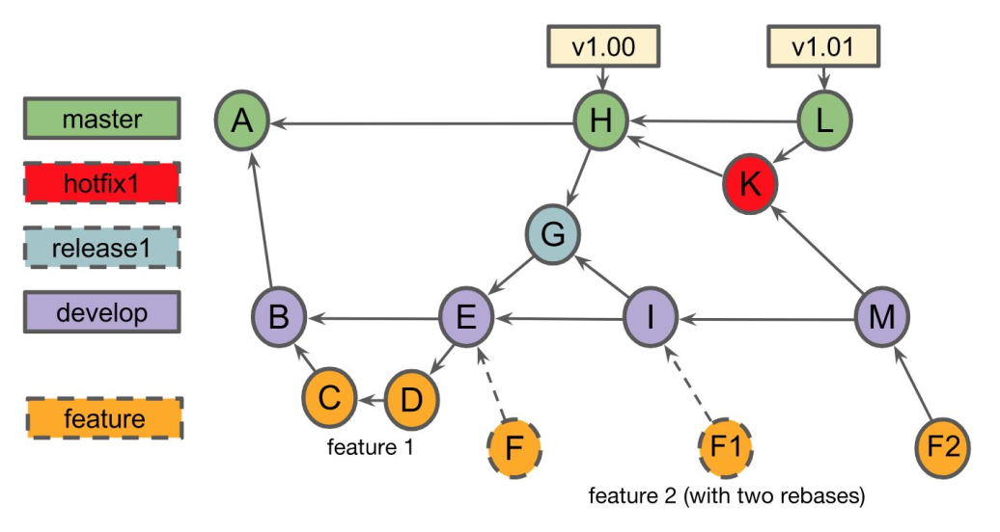
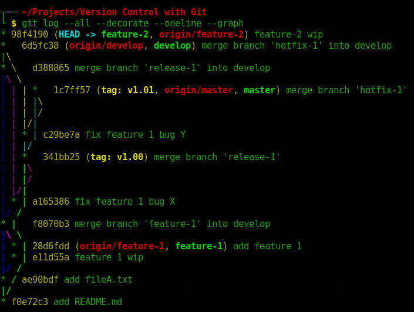

# Final Project: [Version Control with Git](https://www.coursera.org/learn/version-control-with-git)
## by Atlassian University @Coursera
---

**Problem**: Create​ a Git​ repository​ with​ the​ commits​ shown​ in​ the​ commit​ graph​.

**Solution**:

